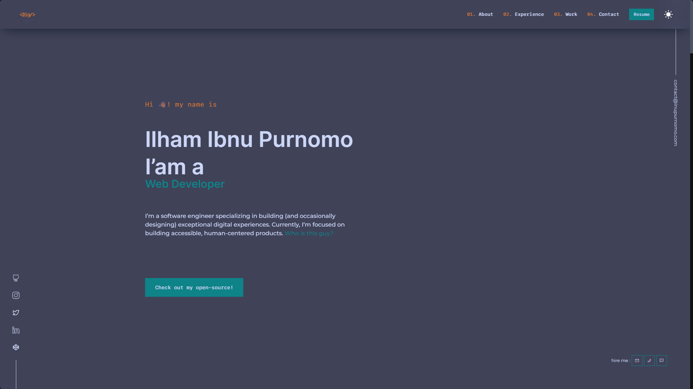

# <p style="text-align: center;">Diggy Porfolio V1</p>

This is a My First Website Portfolio, built with Next.js and Tailwindcss



## Open Source

This portfolio is open source, you can use it for free.\
**But with attribution.**\
Yes, you can fork this repo. Please give me proper credit by linking back to [inupurnomo.com](https://inupurnomo.com "INUPURNOMO"). Thanks!

## Installation

First, run install the dependencies:

```bash
npm install
# or
yarn
```

Then run with:

```bash
npm run dev
# or
yarn dev
```

## Building and Running for Production

```bash
npm run build
# or
yarn build
```

Open [http://localhost:3000](http://localhost:3000) with your browser to see the result.
